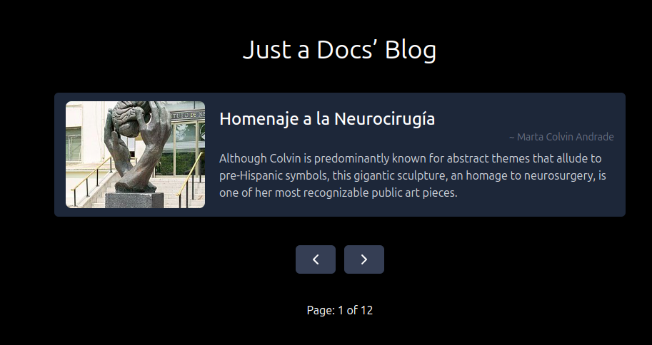

# 📖 Just a Docs' Blog
A simple blog-like ReactJS app that displays sculptures and provides pagination functionality.

# 🚀 Features
Displays a list of sculptures with details (artist, name, description, and image).
Pagination system to navigate between different sculptures.
Clean and responsive UI with TailwindCSS.

# 📷️ Screenshot
